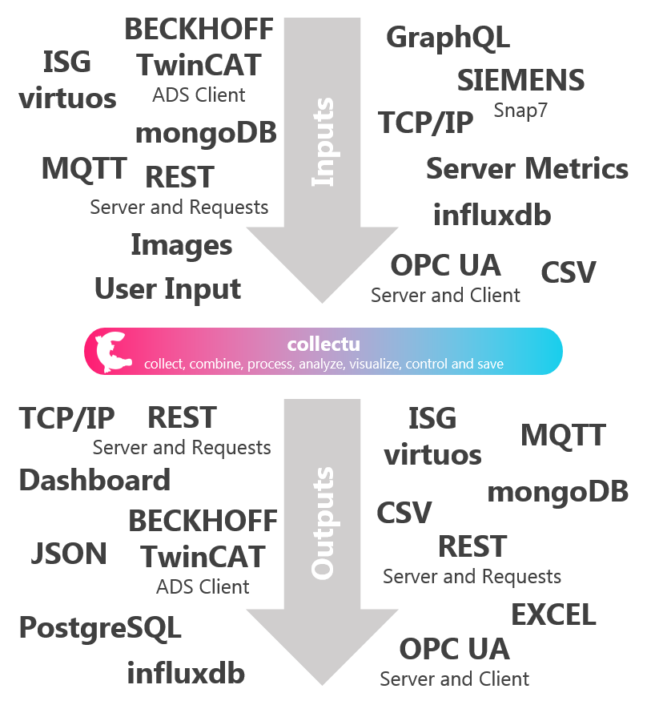
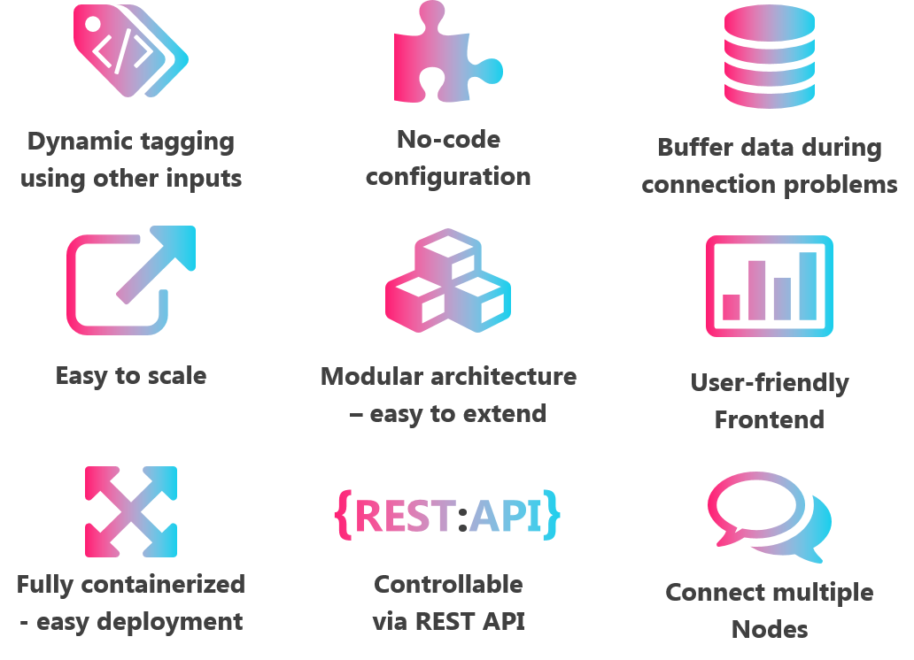
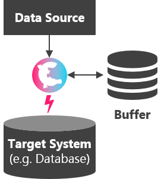
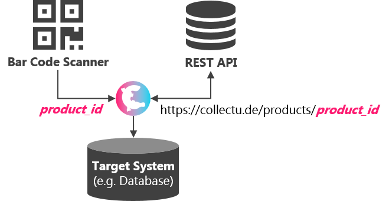
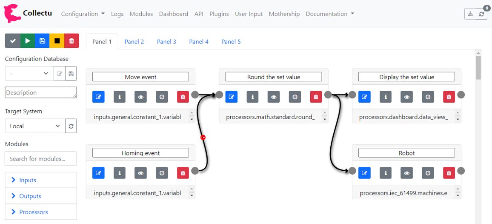
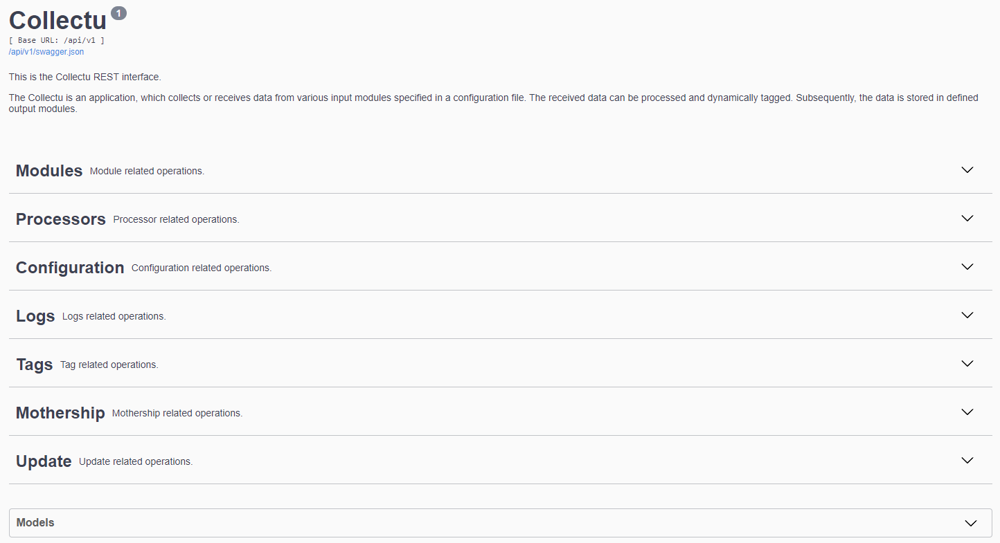
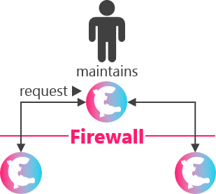
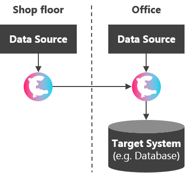
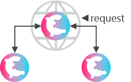

<h1 style="text-align: center;">
  Collectu
</h1>

> Collectu is the open all-in-one solution for your data-driven future.

<p style="text-align: center;">
Collectu is an open and Python-based no-code platform for fast and flexible data collection, combination, processing, 
analysis, visualization, and storage. From various data sources to different target systems. 
Collectu ships with a lot of game-changing advantages and is based on a modular architecture, 
which makes it easily adjustable and extendable.
</p>

> Visit [collectu.de](https://collectu.de) for further information.

--------

<p style="text-align: center;">
  
</p>

## Table of Contents

> * [Quick Start Guide](#quick-start-guide)
> * [Configuration](#configuration) 
>   * [Internal Interface](#internal-interface)
> * [Settings](#settings)
>   * [Environment Variables](#environment-variables)
> * [Features](#features)
>   * [Buffering](#buffering)
>   * [Dynamic variables](#dynamic-variables)
>   * [Frontend](#frontend)
>   * [API](#api)
>   * [Mothership](#mothership)
>   * [Connect Multiple Sources](#connect-multiple-sources)
>   * [Collectu Hub](#collectu-hub)
> * [Development](#development)

## Quick Start Guide

> Please check [collectu.de/docs](https://collectu.de/docs)

## Configuration

The collection and processing of data can be configured by using modules. 
Modules abstract functionality in a generic way, which normally has to be coded manually. 

In general, five different types of modules exist:
- `Input module`: The base module for some input variables and input tags. For example an OPC UA client.
- `Input variable`: A module generating data objects, if the configured variable changes. For example a subscription to an OPC UA variable.
- `Input tag`: A module providing data of the configured variable, if it is requested. For example reading specific OPC UA variable
- `Output module`: A module at the end of a pipeline, receiving data objects. For example a database adapter.
- `Processor module`: A module receiving data, executing custom logic, and sending it to the next module. For example a neural network.

No programming skills are required to configure the pipelines, combining multiple modules. 
It just takes seconds to capture, process, visualize, and save data from your systems. 
To configure your personal data processing pipeline, various predefined modules exists and can be used. 
The configuration can be created using yaml/json files (located in the `configuration` folder), the collectu API, 
or the user-friendly frontend.

By default, the file `configuration/configuration.yml` is used.

Next to the configuration file, a local database is used, saving all executed configurations.
Those configurations can be loaded (using the api or frontend). 
Furthermore, custom configurations can be saved, edited and executed.

### Internal Interface

The data object transferred between the modules is in the format:

```json
{
  "measurement": "my_measurement",
  "time": "2020-11-27 09:58:23.017578",
  "fields": {"temperature":  22, "name":  "Part 1"},
  "tags": {"quality":  "good"}
}
```

**Things to mention:**

- If no fields exist, the data object is not transferred to the next module.
- If no measurement name (empty string) exists, the data object is not transferred to the next module.
- In general, the time stamp is from the original module, which created the data object.

## Settings

> The app functionality can be adjusted on different ways. In general there are two main opportunities. 
> [Environment variables](#environment-variables) and the command line interface (`python src/main.py --help`).

### Environment Variables

Environment variables are used to control basic functionalities of the application.
The variables can be set in the `settings.ini` file, the docker container, or in the `docker-compose.yml`.
If an environment variable is set (for example inside the docker-compose file), 
it will NOT be overwritten by the `settings.ini` values.

| Variable              | Default               | Description                                                                              | 
|-----------------------|-----------------------|------------------------------------------------------------------------------------------|
| APP_ID                | APP_ID=uuid.uuid4()   | The persistent app id.                                                                   |
| APP_DESCRIPTION       | APP_DESCRIPTION=      | The description of the app.                                                              |
| CONFIG                | CONFIG=configuration.yml | The filepath to the configuration file.                                                  | 
| TEST                  | TEST=0                | Start the application in test mode.                                                      |
| IGNORE_START_FAIL     | IGNORE_START_FAIL=0   | Does not stop all modules if one fails initially.                                        |
| AUTO_START            | AUTO_START=1          | Load configuration file on start-up.                                                     |
| AUTO_INSTALL          | AUTO_INSTALL=1        | Automatically install third party requirements.                                          |
| API                   | API=1                 | Start the api.                                                                           |
| API_HOST              | API_HOST=localhost    | Host address of the api.                                                                 | 
| API_PORT              | API_PORT=8181         | Port of the api.                                                                         | 
| FRONTEND              | FRONTEND=1            | Start the frontend.                                                                      |
| FRONTEND_HOST         | FRONTEND_HOST=localhost | Host address of the frontend.                                                            | 
| FRONTEND_PORT         | FRONTEND_PORT=8282    | Port of the frontend.                                                                    |
| URL                   | URL=HOST:PORT         | The address of the application.                                                          |
| COLOR_MODE            | COLOR_MODE=dark       | The color mode, can be dark or light.                                                    |
| MOTHERSHIPS           | MOTHERSHIPS=[]        | The addresses of the motherships API (e.g. "http://127.0.0.1:8181") to report to.        |
| HUB_API_ACCESS_TOKEN  | HUB_API_ACCESS_TOKEN= | The api access token of the hub profile [collectu.de](https://collectu.de).              |
| REPORT_TO_HUB         | REPORT_TO_HUB=0       | Shall this app report and receive tasks from the hub [collectu.de](https://collectu.de). |
| SEND_USAGE_STATISTICS | SEND_USAGE_STATISTICS=1 | Send anonymous usage statistics to the developer.                                        |

## Features

Collectu ships with a lot of game-changing advantages and features described below.



### Buffering

> The buffering enables, to store data locally as long as an output module is not accessible. 
> As soon as the output module is accessible and is not busy with storing current data,
> it is tried to store the buffered data again.

To identify if an output module is accessible or not, it is tried to catch exceptions raised by connection errors.
However, some connection problems may not be clearly identified. 
In this case and also for other unknown issues and errors, the data is stored in a separated buffer. 
For this data the storage in the output module will not be retried.

To use the buffer functionality, an output module providing the buffer functionality (`is_buffer=True`) has to be
defined in the configuration. This module can not store data, except the data to be buffered.

**Note:** A buffer module should be running on the local system to ensure accessibility 
(e.g. [mongoDB](https://www.mongodb.com/try/download/community)).



### Dynamic Variables

The `dynamic variables` functionality enables dynamic configuration parameters. 

>   Use case: You have a QR-code scanner reading the QR-code placed on a product containing the product ID. 
    This parameter has to be stored in the database, and you want to tag it with additional information 
    from another system, in this case from a REST endpoint. 
    So, the REST endpoint path has to be changed each time, a new product was scanned 
    (First scan: path=/api/products/12345 and second scan: path=/api/products/54321). 

This can be achieved by using the `dynamic variables` functionality, 
which links the value of a configuration parameter to a value received from a variable.

For marking a dynamic variable, the following syntax has to be used:

**Start Marker:** `${`

**Syntax:**       `module_id.key` (for global data) or `local.key` (for local module data** - only for tag, output, and processor modules)

**End Marker:**   `}`

You have to replace the placeholders with:

- `module_id`: The id of the module whose data should be used.
- `key`: The key name whose data should be used.

** The current data object available in the according module.



### Frontend

> Not available in collectu-core!

> The frontend provides a user-friendly interface for viewing app information and creating configurations.

The frontend (set environment variable `FRONTEND=1`) is accessible on 
[FRONTEND_HOST:FRONTEND_PORT](http://127.0.0.1:8282).



### API

> Not available in collectu-core!

> The REST API enables access to important information and the control of basic app functionalities. 

The API (set environment variable `API=1`) is accessible on 
[API_HOST:API_PORT](http://127.0.0.1:8181).



### Mothership

> The mothership functionality enables to remotely control collectu instances. 
The remote control allows to update collectu instances, view their current status and logs, or adjust the current 
configuration without changing firewall settings. 
The mothership interface is the tool to easily administrate a large number of devices running collectu.

Every app can act as a mothership. 
The api has to be enabled (set environment variable `API=1`) to use this app as a mothership.
You can define motherships addresses in `settings.ini` or the according docker-compose file 
(e.g. `motherships = ["http://127.0.0.1:8181"]`).

In addition, you can use [collectu.de](https://collectu.de) as a centralized mothership. 
Create a profile on [collectu.de](https://collectu.de), create an api access token and copy the token to 
`settings.ini` (`HUB_API_ACCESS_TOKEN`) or the according docker-compose file. 
Set the environment variable `REPORT_TO_HUB=1`.



### Connect Multiple Sources

> The collected data can be easily exchanged between multiple collectu instances. 
> This enables for example to save machine data on your office pc or combine information gathered from different systems.

For this purpose, various modules are provided. 
You can use, e.g. the REST, TCP, OPC UA, or MQTT (with additional broker) modules to send data to other app instances.



### Collectu Hub

The collectu hub is a central database, where the community can store and share their modules and configurations. 
You can use the experience, knowledge, and best practices of our community to process your data. 
Furthermore, you can offer and share your working configurations and modules with the community.

> Visit [collectu.de](https://collectu.de) for further information.



## Development

For the development of new modules, test factories are provided. 
These are located in the `factories` folder and can be started using the according `.bat` files.

> Further information about developing new modules can be found in `src/modules/README.md` and 
> `src/modules/processors/README.md`
