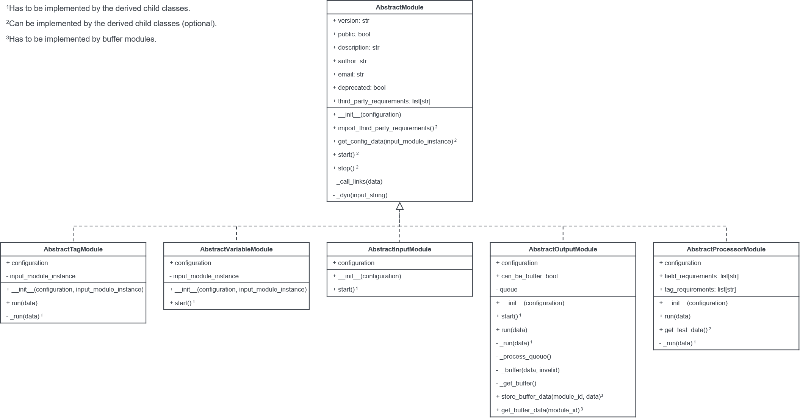

# Modules

> * [Structure](#structure)
> * [Configuration](#configuration)
>   * [Nested Configuration](#nested-configuration)
>   * [Dynamic Variables](#dynamic-variables)

## Structure

Modules have to be derived from the according parent classes. The parent classes are called `AbstractInputModule`, 
`AbstractVariableModule`, `AbstractTagModule`, `AbstractOutputModule`, or `AbstractProcessorModule`. 
The derived child class has to be named `InputModule`, `VariableModule`, `TagModule`, `OutputModule`, 
or `ProcessorModule`. 

> Please mention the naming convention of modules (ending with the version of the module, e.g. `_1`).

The following figure shows the class diagram for the modules.



Every module has to call the parent initialization method: `super().__init__(configuration)`.

Please always provide the following information on class level:

- version
- description
- author
- email
- deprecated (if required)
- third_party_requirements (if required)
- field_requirements (if required and ONLY for processor modules)
- tag_requirements (if required and ONLY for processor modules)

If a variable or tag module requires a client, implement an input module and provide the `input_module_instance`. 

If third party requirements are used by the module, list them in `third_party_requirements`.
Subsequently, they have to be imported in the method `import_third_party_requirements` method.

> Make sure the requirements do not conflict with the global app requirements (listed in `requirements.txt`).
> They have to be the same as the global ones. You can check this by executing the test framework (`src/test/test.py`).

## Configuration

The configuration defines parameters, which can be adjusted by the user in order to control the behaviour of the module.
A configuration is a dataclass directly located under the module class itself (see example below).

The fields of configurations always should have the following attributes:

- `description`
- `dynamic` - default `False`
- `required` - default `False`

Additionally, a validation (`validate=`) can be provided. Available validations are located in `models.validations`. 

```python
class VariableModule(AbstractVariableModule):
    """
    A variable module.

    :param configuration: The configuration object of the module.
    :param input_module_instance: The instance of the parent input module if it exists.
    """
    
    @dataclass
    class Configuration(models.VariableModule):
        """
        The configuration model of the module.
        """
        key: str = field(
            metadata=dict(description="The key of the constant.",
                          dynamic=True,
                          required=True),
            default=None)
        value: Union[str, float, int, bool, list] = field(
            metadata=dict(description="The value of the constant.",
                          dynamic=True,
                          required=True),
            default=None)
        interval: float = field(
            metadata=dict(description="Interval in seconds in which the module provides the constants.",
                          required=False,
                          validate=Range(min=0, max=1000)),
            default=1)
```

### Dynamic Variables

If a configuration variable can be dynamic (`dynamic=True`), you have to call `self._dyn(self.configuration.value)`
in order to try to replace the marker (`${module_id.key}`) with the actual value in your code.

### Nested Configuration

Nested (here lists) configurations (e.g. `List[Threshold]`) need a special validation. This is achieved by
calling `NestedListClassValidation` on the according field. 
Furthermore, the `__post_init__` method has to be called in the configuration class, 
in order to set the validated and deserialized field and dynamic variables.

Add the following (example) under the parent dataclass, containing a nested dataclass:

```python
def __post_init__(self):
    super().__post_init__()
    thresholds = []
    for threshold_dict in self.thresholds:
        thresholds.append(Threshold(**threshold_dict))
    setattr(self, "thresholds", thresholds)
```

Add the following under the nested dataclass:

```python
def __post_init__(self):
    validate_module(self)
```

Examples for nested modules:

- inputs.general.user_input_1
- processors.dashboard.threshold_1
- inputs.ads_client_struct_1
- inputs.ads_client_struct_2

**Note:** Nested configurations are currently not supported on the frontend.
